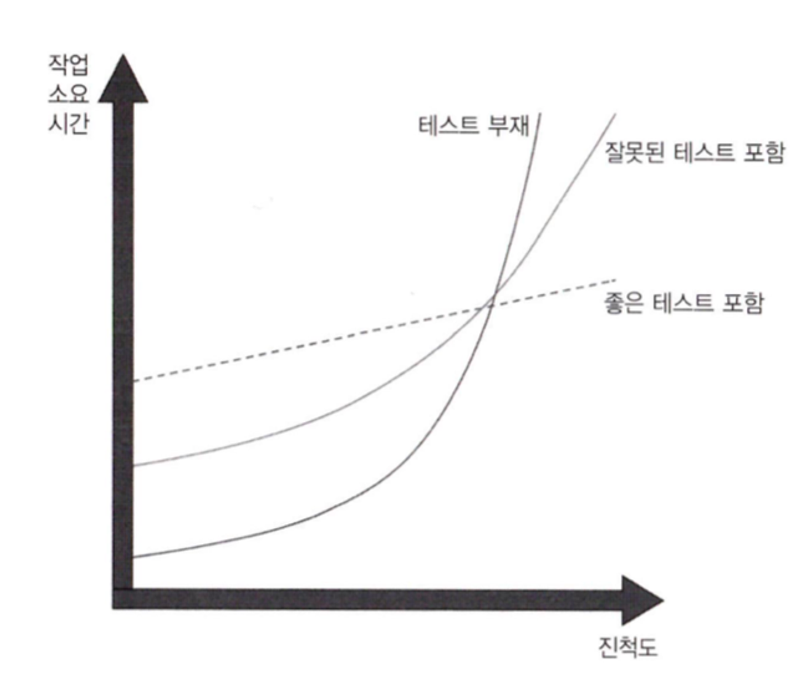

# Chapter 01: 단위 테스트의 목표

## 단위 테스트의 주목표
- 단위 테스트 활동은 더 나은 설계로 이어질 수 있지만, 이는 **사이드 이펙트**일 뿐 **주목표는 아니다**.
- 단위 테스트의 주목표는 **지속 가능한 성장**을 가능하게 하는 것이다.
- 테스트가 없는 프로젝트는 초기에는 빠르게 진행되지만, 이후 진척이 극도로 느려진다.
- 테스트는 **안전망** 역할을 하여:
  - 새로운 기능을 도입하거나 리팩토링 후에도 기존 기능이 잘 작동하는지 확인할 수 있다.

---

## 테스트 스위트 품질 측정을 위한 커버리지 지표
### 커버리지 지표 종류
1. **코드 커버리지**: 실행된 코드 라인의 비율  
   - 계산식: `(실행된 코드 라인 수 / 전체 코드 라인 수) × 100%`
2. **분기 커버리지**: 통과된 분기의 비율  
   - 계산식: `(통과된 분기 수 / 전체 분기 수) × 100%`

### 커버리지 지표의 문제점
1. 테스트 대상 시스템의 **모든 가능한 결과를 검증한다고 보장할 수 없다**.
2. 외부 라이브러리의 코드 경로를 **포괄할 수 있는 커버리지 지표는 없다**.
3. 커버리지 지표는 **좋은 부정 지표**이지만 **나쁜 긍정 지표**다.  
   - 커버리지 숫자가 낮으면(약 60% 이하) 테스트되지 않은 코드가 많다는 것을 의미한다.
   - 하지만 커버리지가 높다고 테스트가 충분히 잘 작성되었음을 보장하지는 않는다.

---

## 무엇이 성공적인 테스트 스위트를 만드는가?
1. **개발 주기에 통합**돼 있어야 한다.
2. 코드베이스에서 **가장 중요한 부분**을 대상으로 해야 한다.  
   - 예: 도메인 모델, 비즈니스 로직 등.
3. **최소 유지비**로 **최대 가치를 제공**해야 한다.  
   - 단순히 커버리지를 높이는 것이 아니라, 실제로 유용한 테스트를 작성해야 함.

---

## 가치 있는 테스트를 식별하는 방법
- **도메인 모델**과 **비즈니스 로직**에 관심을 두고, 중요한 코드에 집중하라.
- 테스트는 단순히 작성하는 것에 그치지 않고, 유지보수성과 효율성을 고려해야 한다.
